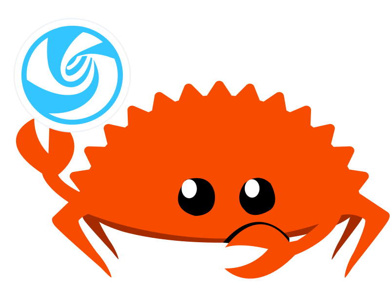

<p align="center"></p>

# dtk-rs

Rust bindings for DTK6 (dtkwidget). Goal: write deepin apps with DTK UIs in pure Rust.

- **Safe wrappers** over a small `cxx` FFI layer — application code never touches `unsafe`.
- **~100 DTK classes** bound by a header-scanning generator (`DComboBox`, `DSpinner`, `DDialog`, `DListView`, …) plus hand-written core (`DApplication`, `DMainWindow`, layouts, `QTableWidget`, timers, painting).
- **Any signal** can be connected at runtime by name — no per-signal glue code.
- Linux + Qt6 + DTK6 only. Not cross-platform (DTK isn't either).

## Requirements

A deepin/UOS (or any) Linux with Qt6 and DTK6 development packages; `pkg-config` must find `Qt6Widgets`, `dtk6widget`, etc. Build:

```sh
cargo build
```

## Layout

```
dtk-sys/   FFI layer: C++ shim (cpp/) + cxx::bridge + build.rs (locates Qt6/DTK6 via pkg-config, moc for the signal relay)
dtk/       safe wrappers: hand-written core classes + widgets.rs (generator output)
tools/gen.py  header-scanning generator; rescans /usr/include/dtk6/DWidget/*.h and regenerates bindings
GEN_REPORT.md coverage report: what was generated, what was skipped (with reasons)
TODO.md      known gaps and follow-ups
```

## Usage

Not on crates.io yet; add from git:

```sh
cargo add dtk --git https://github.com/st0nie/dtk-rs.git
```

```rust
use dtk::*;

let app = DApplication::new("my-app");
let win = DMainWindow::new();
win.titlebar().set_title("Hello");
let btn = DSuggestButton::new("Click me");
btn.on_clicked(|| println!("clicked"));
btn.show();
win.resize(400, 300);
win.show();
std::process::exit(app.exec());
```

Any signal can be connected (runtime connect by name):

```rust
widget.connect_signal("windowRadiusChanged()", || { ... });
widget.connect_signal_i32("currentRowChanged(int)", |row| { ... });
```

The generator-covered classes live under `dtk::widgets` (DComboBox, DSpinner, DDialog…).

## Examples

All examples live in [`dtk/examples/`](dtk/examples/) and build with `cargo build --examples`.

| Example | Shows | Run |
|---|---|---|
| [`hello.rs`](dtk/examples/hello.rs) | Minimal app: `DMainWindow`, titlebar, `DLabel`, buttons, `DMessageBox`, sharing state into callbacks via `Rc<Cell<_>>` | `cargo run --example hello` |
| [`controls.rs`](dtk/examples/controls.rs) | Control tour: `DLineEdit`, `DSearchEdit`, `DSwitchButton`, `DSpinner`, floating messages via `DMessageManager`, connecting arbitrary signals by name | `cargo run --example controls` |
| [`mpsc_eventfd.rs`](dtk/examples/mpsc_eventfd.rs) | **Background thread → GUI** with `std::sync::mpsc` + `eventfd` + `QSocketNotifier` (see below) | `cargo run --example mpsc_eventfd` |
| [`demo.rs`](dtk/examples/demo.rs) | Binding self-checks: real argv, palette round-trip, `PaintDelegate` custom cell painting, `QSocketNotifier` on a pipe | `cargo run --example demo` |
| [`dialog_selfcheck.rs`](dtk/examples/dialog_selfcheck.rs) | `DDialog` checks | `cargo run --example dialog_selfcheck` |

Headless smoke tests (CI-friendly, no display needed):

```sh
QT_QPA_PLATFORM=offscreen ./target/debug/examples/demo --smoke
QT_QPA_PLATFORM=offscreen ./target/debug/examples/mpsc_eventfd --smoke
```

## Threading: worker → GUI with mpsc + eventfd

Qt widgets may only be touched from the GUI thread, and dtk-rs wrappers are `!Send` — the compiler enforces it. To get background work (network, file scans, systemd/PSI polling…) into the UI, use the same trick as Qt's queued `invokeMethod`, with plain Rust pieces:

```text
 worker thread                    GUI thread (event loop)
 ┌──────────────┐  mpsc::Sender<Msg>    ┌─────────────────────────┐
 │ do work      │ ────────────────────▶ │ mpsc::Receiver<Msg>     │
 │ tx.send(msg) │                       │ drained with try_recv() │
 │ poke eventfd │ ─── eventfd byte ───▶ │ QSocketNotifier::       │
 └──────────────┘                       │   on_activated(...)     │
                                        └─────────────────────────┘
```

- The channel carries **plain `Send` data** (`enum Msg { Progress(i32), Done(String) }`) — never widget pointers.
- The `eventfd` is only a **wakeup**: one 8-byte write per send; `QSocketNotifier` watches the read end and its callback runs on the GUI thread, where draining the channel and touching widgets is legal.
- **Always drain the eventfd counter in the callback** — the notifier is level-triggered and refires forever otherwise.
- Commands back to the worker (cancel, config) go through `Arc<AtomicBool>` or a second channel.
- No polling `QTimer` needed: the notifier fires exactly when data arrives.

Full working code (with a cancel button and a headless `--smoke` self-check): [`dtk/examples/mpsc_eventfd.rs`](dtk/examples/mpsc_eventfd.rs). The same `QSocketNotifier` pattern works for `signalfd` (Unix signals → event loop) and pipes.

## Design

- **Lifetime — two wrapper kinds.** Widget wrappers are non-owning raw pointers (`!Send`, single GUI thread): Qt's parent-child tree owns the objects, children die with their parent, top-level windows die with `QApplication`. They intentionally have no `Drop`. Value-type wrappers (`QColor`, `QFont`, `QPalette`, `QPixmap`, …) own a heap copy and free it via shim `*_delete` in `Drop`.
- **Callbacks are `'static`** — share widgets/state into them with `Rc`/`RefCell`/`Cell` (never `Arc<Mutex>`: everything runs on one thread anyway).
- **Signals**: `DtkRelay` (Q_OBJECT + SLOT) string-connects any signal -> Rust callback id -> closure in a thread_local registry. Unregister with `dtk::unregister_callback(id)` when done; `QTimer::single_shot` self-cleans.
- **Event overrides**: `DtkAppEx` (QEvent::Quit guard) / `DtkMainWindowEx` (showEvent/closeEvent) shim subclasses -> Rust callbacks. Entry points: `DApplication::new_with_quit_guard`, `DMainWindow::new_with_events`.
- **Custom painting**: `PaintDelegate` (QStyledItemDelegate subclass) forwards paint to Rust, with `Painter` primitives + `ModelIndex::data_*`.
- **Type mapping**: QString<->&str/String, numbers direct, enums/QFlags->i32 (`dtk::qt` constants module), QColor/QFont/QPalette/QPixmap/QSize/QPoint/QRect value types -> heap-allocated wrappers, QWidget* and DTK class pointers <-> wrappers.
- **QSocketNotifier**: `QSocketNotifier::new(fd)` + `on_activated`; pairs with eventfd/signalfd/pipe — see the threading section above.
- **Generator**: regex-parses DTK headers (they are very regular). Only methods whose param/return types all map cleanly are generated; the rest land in GEN_REPORT.md with reasons. Base-class Qt methods (e.g. `QProgressBar::setValue`) are added by hand to the shim when needed.

## Regenerating

```
python3 tools/gen.py && cargo build
```

Generated files (don't hand-edit): `dtk/src/widgets.rs`, `dtk-sys/src/gen_ffi.rs`, `dtk-sys/cpp/dtk_gen_shim.cpp`, `dtk-sys/include/dtk_gen_shim.h`.

## License

MIT — see [LICENSE](LICENSE).
